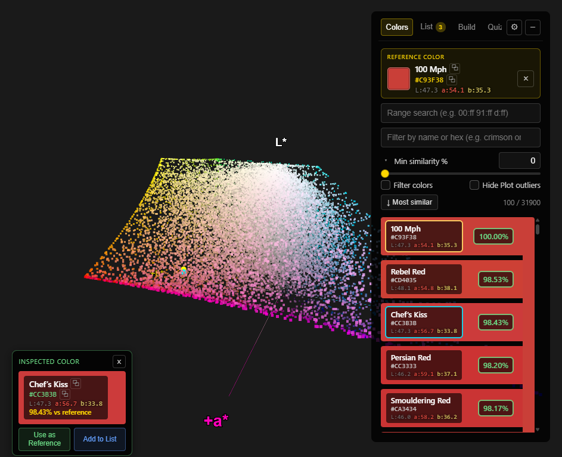

# Svet

A 3D color space visualizer that plots colors in LAB (L\*a\*b\*) space using Three.js.

Live site: https://VadimEngine.github.io/svet


<p>
  
</p>

## Development

```bash
npm install
npm start
```

Opens the app at http://localhost:3000 with hot reload.

## Deploy to GitHub Pages

```bash
npm run deploy
```

This runs `npm run build` automatically first, then pushes the `build/` folder to the `gh-pages` branch. The live site updates within a minute.

The deployed URL is controlled by the `homepage` field in `package.json`:

```json
"homepage": "https://VadimEngine.github.io/svet"
```

## Build only

```bash
npm run build
```

Outputs a production build to the `build/` folder without deploying.

## Deploy to Android

The Android app is a Capacitor wrapper around the React build. After making changes to the React source:

```bash
PUBLIC_URL=. npm run build
npx cap copy android
```

`PUBLIC_URL=.` makes asset paths relative so they work when loaded from the Android filesystem. `cap copy` syncs the new `build/` output into the Android project.

Then open Android Studio and run the app on your device:

```bash
npx cap open android
```

In Android Studio: wait for Gradle sync, select your device in the toolbar dropdown, and click **Run** (▶).

> **Note:** Do not use `npm run deploy` for Android builds — that sets `PUBLIC_URL` to the GitHub Pages URL, which breaks local file loading on Android.
